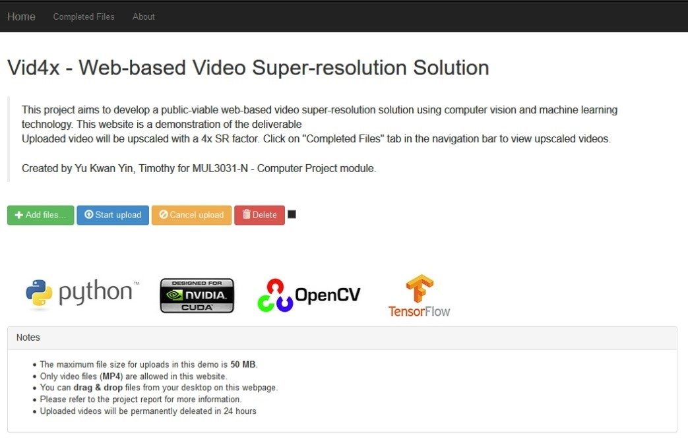

# INTRODUCTION
Public-viable image super-resolution service was made available by Waifu2X, a free-to-use web-based image super-resolution service. However, super-resolution services for video are only available via commercial product, for instance, Insta4K produce by Red Giant . 
This project aims to develop a public-viable web-based video super-resolution solution using computer vision and machine learning technology. The software will be relatively light-weighted to ensure ease of deployment.
The project will deliver a video-upscaling service with a fully functional web interface.

Features are as follow:

* Functional features:
  * Web-based uploading portal for user to upload video
  * Super-resolution up to 4x
  * A list of processed video for user to download

* Non-functional features:
  * Responsive web design
  * NoSQL database

# SCREENSHOT

# SAMPLE
| Original(320x420) | Upscaled(2560x1920) |
------------ | -------------
 | 

| Original(426x420) | Upscaled(2982x1680) |
------------ | -------------
 | 

| Original(320x420) | Upscaled(2560x1920) |
------------ | -------------
 | 

# REFERENCIES

* Nagadomi, “Image Super-Resolution for Anime-Style Art ”, Github, 12 Oct
2015, Available at: https://github.com/nagadomi/waifu2x , Accessed 20 Nov 2017

* Red Giant LLC

* Chao Dong, Chen Change Loy, Kaiming He, Xiaoou Tang, "Image Super-Resolution Using Deep Convolutional Networks", arXiv

* Christian Ledig et al., "Photo-Realistic Single Image Super-Resolution Using a
Generative Adversarial Network ", arXiv, 25 May 2017

* Zs Dong Hao, VGG19 Image Net, Github, 08 May 2017, Available at: https://github.com/zsdonghao/tensorlayer/blob/master/example/tutorial_vgg19.py,
Accessed 20 Nov 2017

* NTIRE2017, DIV2K - bicubic downscaling x4 competition

* MIRFLICKR, Available at: http://press.liacs.nl/mirflickr/mirdownload.html

* Web Fundamentals, Google, Available at: https://developers.google.com/web/fundamentals/
 
